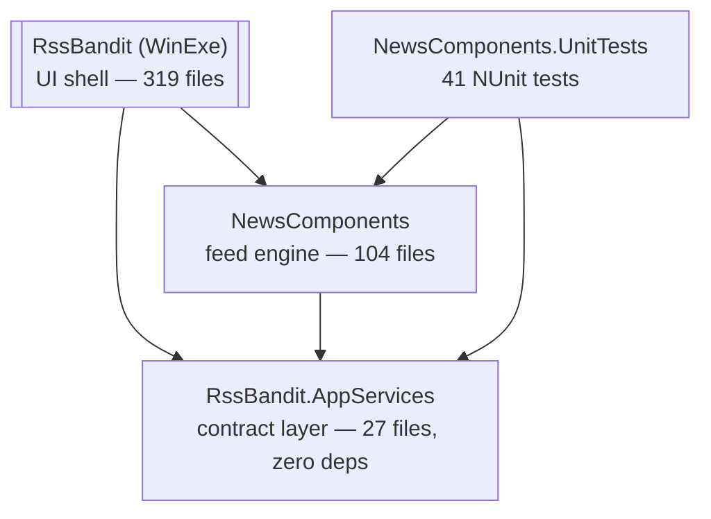

# RssBandit Code Graph & Modernization Map

*Generated June 2026 from a graphify knowledge graph (tree-sitter AST over all C# sources)
plus MSBuild-layer extraction and per-module agent briefs.*

## Artifacts

| Artifact | What it is |
|---|---|
| `graphify-out/graph.json` | Type/member-level knowledge graph: 10,124 nodes, 16,287 edges, 613 Leiden communities. Query it with `/graphify query "<question>"` (~9k tokens/query vs ~890k naive — 100× cheaper). |
| `graphify-out/GRAPH_REPORT.md` | Audit report: god nodes, cohesion scores, surprising connections. |
| `docs/architecture/codegraph/projects.json` | MSBuild layer: all 30 csproj — TFMs, references, packages. |
| `docs/architecture/codegraph/msbuild_graph.md` | Project dependency Mermaid diagram + binary-dep and package inventories. |
| `docs/architecture/codegraph/module_briefs.md` | One-page modernization brief per module (grep-evidenced). |
| `docs/architecture/codegraph/extract_msbuild.py` | Regenerates the MSBuild layer. Graphify regenerates incrementally via `/graphify source --update`. |

## The shape of the system

The **main solution (`source/RSS Bandit.sln`) contains only 4 projects**, all already
SDK-style targeting `net5.0-windows10.0.19041`:

The other **26 projects are satellites** (plugins, child libraries, installer, build
tooling) on legacy csproj formats and .NET Framework 3.5/4.0. Almost all can be
ignored or dropped for the modernization milestone (see briefs).

God nodes (coupling hubs) from the knowledge graph: `FeedSource` (189 edges),
`RssBanditApplication` (180), `WinGuiMain` (161). The MSHTML/IE interop cluster that
also ranks top-10 lives entirely in the **vestigial IEControl satellite** — the main
app already migrated to WebView2 (old IEControl calls are commented out).

## Key findings

1. **A prior modernization pass already happened** (net5.0 + WebView2 + SDK-style core). The milestone is finishing it: net5.0 has been EOL since May 2022.
2. **Serialization is the #1 runtime blocker**: `SoapFormatter` (RssBanditApplication.cs:2258, 2320) + `BinaryFormatter` (UI feed state; engine DownloadRegistryManager/DownloadTask). BinaryFormatter is removed in .NET 9+.
3. **Commercial UI lock-in**: Infragistics WinForms 20.2.14 across 36 files (pervasive), SandDock docking in 7 files (core layout), Divelements wizard in 9 files (contained). License/compat verification is on the critical path.
4. **Legacy networking**: 18 `HttpWebRequest` occurrences in 10 engine files; zero HttpClient. BITS COM interop for enclosure downloads (8 files).
5. **Dead weight**: GoogleReader/NewsGator/Facebook feed sources are dead services; every plugin targets a dead service; IEControl/ShellLib/Jumplist are unreferenced; RssBandit.UnitTests can't build.
6. **Duplicated code**: RelationCosmos has its live copy inside NewsComponents (ChildProjects copy is stale); ThListView compiles directly into RssBandit.exe via SDK glob (its standalone csproj is vestigial).
7. **Contract layer is almost portable**: AppServices has zero dependencies but leaks WinForms types (`Keys`, `Image`) in 5 files — the one repair needed to make it a clean seam.
8. **Tests**: 41 real NUnit tests exist for the engine but 3 fixtures depend on the ancient Cassini web server binary.

## Recommended build-fix order → "smoothly running WinForms"

**Phase A — make it build (low risk, mechanical)**
1. Retarget the 4 main projects `net5.0-windows` → `net8.0-windows` (or `net10.0-windows`); bump `Microsoft.Web.WebView2`, `log4net`, `Newtonsoft.Json`, NUnit/Test SDK packages.
2. Verify Infragistics 20.2.14 loads on .NET 8; if not, upgrade license/version or stub the affected surfaces. Same check for SandDock and Divelements (binary-era vendors — have fallback plan: DockPanelSuite for docking).
3. Keep SoapFormatter/BinaryFormatter compiling on net8 (obsolete warnings only) — they hard-break at net9+.
4. Drop dead satellites from any build scripts (IEControl, ShellLib, Jumplist, RssBandit.UnitTests, plugins).

**Phase B — make it run reliably**
5. Replace SoapFormatter/BinaryFormatter state persistence with System.Text.Json (UI feed state + engine download registry). Migration shim for users' existing state files.
6. Wrap AsyncWebRequest/SyncWebRequest over HttpClient (TLS 1.3, HTTP/2, proxy support).
7. Remove dead feed sources (GoogleReader, NewsGator, Facebook) and dead IE code paths.
8. Lucene.Net 2.9 → 4.8 (breaking: analyzers, query API, index format — plan an index rebuild on first run).

**Phase C — health**
9. Replace Cassini with WireMock.Net; consolidate tests on NUnit; wire up CI (`dotnet build` + `dotnet test` on the 4-project solution).
10. Mime4Net → MimeKit if NNTP support is kept; otherwise drop NNTP.

## MAUI feasibility (the longer game)

- **UI shell: rewrite, not port.** SandDock docking, Infragistics grids, tray/P-Invoke UX are desktop-WinForms idioms.
- **Engine: extractable.** A `NewsComponents.Core` (BanditFeedSource + RSS/Atom parsing + storage + search) can go cross-platform once BITS, WindowsRssFeedSource, WindowsAPICodePack, and the 9 DllImports are isolated behind interfaces.
- **AppServices is the seam.** Strip the WinForms types from 5 contract files and it becomes the portable boundary both shells share.
- Realistic sequence: finish the WinForms milestone first (Phases A–C), then extract the portable core, then evaluate MAUI/Avalonia against it. Avalonia is worth weighing alongside MAUI for a desktop-first reader.

## Token cost of this exercise

Graph construction: 505 code files via free AST extraction; ~31k Haiku tokens for
readme semantics. Module briefs: ~161k Haiku tokens across 6 scoped agents.
Total agent spend ≈ 192k Haiku tokens (≈ $0.25 API-equivalent) — the structural
work was deterministic, models were spent only on interpretation.
