# RssBandit MSBuild Dependency Graph

30 projects; 4 in `source/RSS Bandit.sln`.

## Project dependency diagram (ProjectReference edges)

```mermaid
flowchart TD
    AdsBlocker2_AddIn["AdsBlocker2.AddIn<br/>net-fx v4.0"]
    BanditBuildTasks_UnitTests["BanditBuildTasks.UnitTests<br/>net-fx v4.0"]
    BanditBuildTasks["BanditBuildTasks<br/>net-fx v4.0"]
    DiffPatchResources["DiffPatchResources<br/>?"]
    Microsoft_ApplicationBlocks_ExceptionManagement["Microsoft.ApplicationBlocks.ExceptionManagement<br/>?"]
    IEControl["IEControl<br/>net5.0-windows10.0.19041"]
    Jumplist[["Jumplist<br/>net-fx v3.5"]]
    MemeTracker["MemeTracker<br/>?"]
    RelationCosmos["RelationCosmos<br/>?"]
    ShellLib["ShellLib<br/>?"]
    WinTester["WinTester<br/>?"]
    ShortcutsEditor["ShortcutsEditor<br/>?"]
    Test[["Test<br/>net-fx v4.0"]]
    NewsComponents_UnitTests["NewsComponents.UnitTests<br/>net5.0-windows10.0.19041"]:::main
    NewsComponents["NewsComponents<br/>net5.0-windows10.0.19041"]:::main
    Rssbandit_Feed_Installer["Rssbandit Feed Installer<br/>net-fx v3.5"]
    RssBandit_AppServices["RssBandit.AppServices<br/>net5.0-windows10.0.19041"]:::main
    RssBandit_UnitTests["RssBandit.UnitTests<br/>net-fx v4.0"]
    RssBandit[["RssBandit<br/>net5.0-windows10.0.19041"]]:::main
    ThreadedListViewControl["ThreadedListViewControl<br/>?"]
    BlogThis_LiveWriter["BlogThis.LiveWriter<br/>net-fx v4.0"]
    BlogThis_WBloggar["BlogThis.WBloggar<br/>net-fx v4.0"]
    Delicious["Delicious<br/>net-fx v4.0"]
    AmphetaRatePlugin["AmphetaRatePlugin<br/>?"]
    BlogThisUsingWBloggarPlugin["BlogThisUsingWBloggarPlugin<br/>?"]
    MailThis["MailThis<br/>net-fx v4.0"]
    OneNote["OneNote<br/>net-fx v4.0"]
    OneNote_["OneNote<br/>?"]
    UnitTests["UnitTests<br/>?"]
    Twitter["Twitter<br/>net-fx v4.0"]
    AdsBlocker2_AddIn --> NewsComponents
    AdsBlocker2_AddIn --> RssBandit_AppServices
    BanditBuildTasks_UnitTests --> BanditBuildTasks
    Test --> IEControl
    NewsComponents_UnitTests --> RssBandit_AppServices
    NewsComponents_UnitTests --> NewsComponents
    NewsComponents --> RssBandit_AppServices
    RssBandit_UnitTests --> RssBandit_AppServices
    RssBandit_UnitTests --> RssBandit
    RssBandit_UnitTests --> NewsComponents
    RssBandit --> NewsComponents
    RssBandit --> RssBandit_AppServices
    classDef main fill:#cde4ff,stroke:#2266aa
```

## Projects

| Project | TFM | Output | SDK-style | In main sln | Proj refs | Binary refs | Packages |
|---|---|---|---|---|---|---|---|
| NewsComponents | net5.0-windows10.0.19041 | Library | yes | yes | 1 | 1 | 9 |
| NewsComponents.UnitTests | net5.0-windows10.0.19041 | Library | yes | yes | 2 | 1 | 6 |
| RssBandit | net5.0-windows10.0.19041 | WinExe | yes | yes | 2 | 8 | 12 |
| RssBandit.AppServices | net5.0-windows10.0.19041 | Library | yes | yes | 0 | 0 | 0 |
| AdsBlocker2.AddIn | net-fx v4.0 | Library | LEGACY |  | 2 | 0 | 0 |
| AmphetaRatePlugin | ? | Library | LEGACY |  | 0 | 0 | 0 |
| BanditBuildTasks | net-fx v4.0 | Library | LEGACY |  | 0 | 0 | 0 |
| BanditBuildTasks.UnitTests | net-fx v4.0 | Library | LEGACY |  | 1 | 1 | 0 |
| BlogThis.LiveWriter | net-fx v4.0 | Library | LEGACY |  | 0 | 1 | 0 |
| BlogThis.WBloggar | net-fx v4.0 | Library | LEGACY |  | 0 | 1 | 0 |
| BlogThisUsingWBloggarPlugin | ? | Library | LEGACY |  | 0 | 0 | 0 |
| Delicious | net-fx v4.0 | Library | LEGACY |  | 0 | 1 | 0 |
| DiffPatchResources | ? | Exe | LEGACY |  | 0 | 0 | 0 |
| IEControl | net5.0-windows10.0.19041 | Library | yes |  | 0 | 0 | 0 |
| Jumplist | net-fx v3.5 | WinExe | LEGACY |  | 0 | 2 | 0 |
| MailThis | net-fx v4.0 | Library | LEGACY |  | 0 | 1 | 0 |
| MemeTracker | ? | Exe | LEGACY |  | 0 | 1 | 0 |
| Microsoft.ApplicationBlocks.ExceptionManagement | ? | Library | LEGACY |  | 0 | 0 | 0 |
| OneNote | net-fx v4.0 | Library | LEGACY |  | 0 | 2 | 0 |
| OneNote | ? | Library | LEGACY |  | 0 | 0 | 0 |
| RelationCosmos | ? | Library | LEGACY |  | 0 | 0 | 0 |
| RssBandit.UnitTests | net-fx v4.0 | Library | LEGACY |  | 3 | 1 | 0 |
| Rssbandit Feed Installer | net-fx v3.5 | Library | LEGACY |  | 0 | 0 | 0 |
| ShellLib | ? | Library | LEGACY |  | 0 | 0 | 0 |
| ShortcutsEditor | ? | Library | LEGACY |  | 0 | 0 | 0 |
| Test | net-fx v4.0 | WinExe | LEGACY |  | 1 | 2 | 0 |
| ThreadedListViewControl | ? | Library | LEGACY |  | 0 | 0 | 0 |
| Twitter | net-fx v4.0 | Library | LEGACY |  | 0 | 1 | 0 |
| UnitTests | ? | Library | LEGACY |  | 0 | 0 | 0 |
| WinTester | ? | Library | LEGACY |  | 0 | 0 | 0 |

## Binary (HintPath) dependencies — modernization risk surface

- `Cassini` — used by NewsComponents.UnitTests
- `Eyefinder` — used by RssBandit
- `Interop.SHDocVw` — used by Test
- `Interop.ThumbCache` — used by RssBandit
- `Interop.WMPLib` — used by RssBandit
- `Interop.iTunesLib` — used by RssBandit
- `IronPython` — used by MemeTracker
- `Microsoft.ApplicationBlocks.ExceptionManagement` — used by RssBandit
- `Microsoft.ApplicationBlocks.ExceptionManagement.Interfaces` — used by RssBandit
- `Microsoft.WindowsAPICodePack` — used by Jumplist
- `Microsoft.WindowsAPICodePack.Shell` — used by Jumplist
- `OneNoteImporter` — used by OneNote
- `Org.Mime4Net` — used by NewsComponents
- `SandDock` — used by RssBandit
- `blogExtension` — used by BlogThis.LiveWriter, BlogThis.WBloggar, Delicious, MailThis, OneNote, RssBandit, Twitter
- `nunit.framework` — used by BanditBuildTasks.UnitTests, RssBandit.UnitTests, Test

## NuGet packages

- `CommonServiceLocator` 2.0.6 — RssBandit
- `Divelements.WizardFramework` 1.2.22 — RssBandit
- `Facebook` 7.0.6 — NewsComponents
- `Infragistics.WinForms.Editors` 20.2.14 — RssBandit
- `Infragistics.WinForms.ExplorerBar` 20.2.14 — RssBandit
- `Infragistics.WinForms.StatusBar` 20.2.14 — RssBandit
- `Infragistics.WinForms.TabControl` 20.2.14 — RssBandit
- `Infragistics.WinForms.Toolbars` 20.2.14 — RssBandit
- `Infragistics.WinForms.Tree` 20.2.14 — RssBandit
- `Lucene.Net` 2.9.4.1 — NewsComponents
- `Lucene.Net.Contrib` 2.9.4.1 — NewsComponents
- `Microsoft.NET.Test.Sdk` 16.8.3 — NewsComponents.UnitTests
- `Microsoft.NETCore.Targets` 5.0.0 — NewsComponents, NewsComponents.UnitTests
- `Microsoft.Web.WebView2` 1.0.774.44 — RssBandit
- `NUnit` 3.13.1 — NewsComponents.UnitTests
- `NUnit3TestAdapter` 3.17.0 — NewsComponents.UnitTests
- `Newtonsoft.Json` 12.0.3 — NewsComponents
- `SingleInstanceHelper` 1.0.3 — RssBandit
- `SoapFormatter` 1.0.11 — RssBandit
- `System.Windows.Extensions` 5.0.0 — NewsComponents
- `Unity` 5.11.9 — RssBandit
- `WindowsAPICodePack-Core` 1.1.2 — NewsComponents
- `WindowsAPICodePack-Shell` 1.1.1 — NewsComponents
- `log4net` 2.0.12 — NewsComponents
- `xunit` 2.4.1 — NewsComponents.UnitTests
- `xunit.runner.visualstudio` 2.4.3 — NewsComponents.UnitTests
